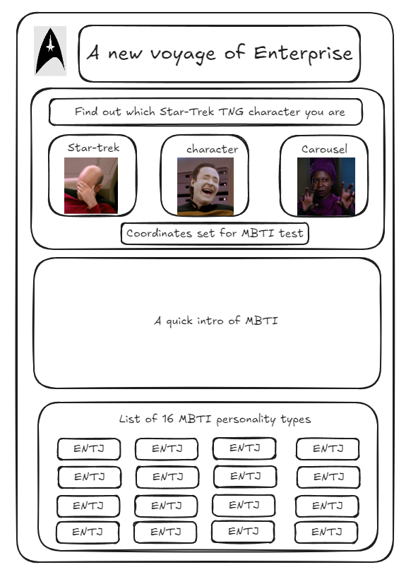
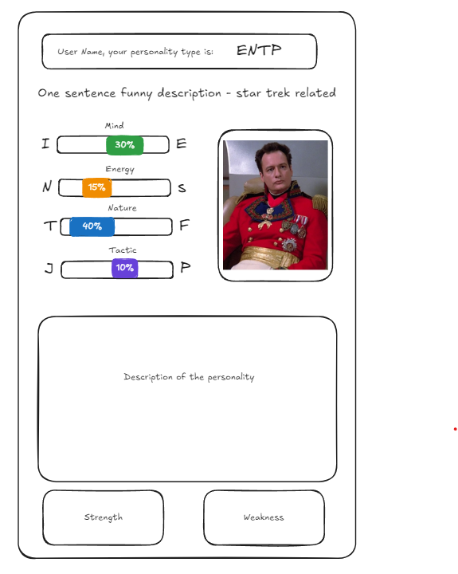
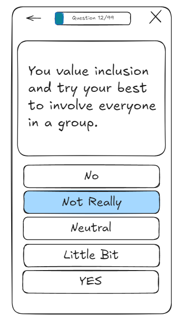
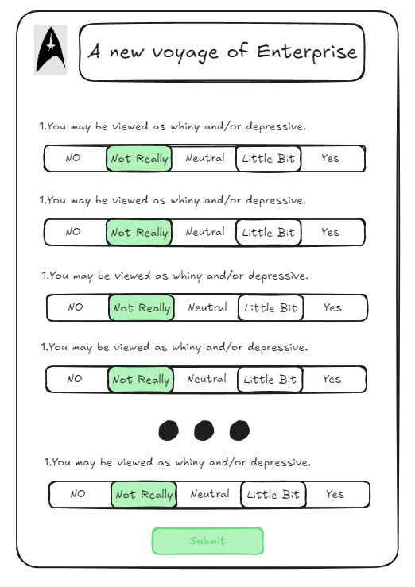

# MBTI - the Star Trek TNG version

## Overview

This project is a Myers-Briggs Type Indicator (MBTI) test that uses characters from _Star Trek: The Next Generation_ (TNG) to represent and illustrate each of the 16 personality types.

### Problem Space

MBTI personality types have become increasingly popular in recent years, with many people using them to gain insights into their own traits and behaviors. However, even with detailed descriptions, it can be difficult for individuals to truly visualize how these personality types manifest in everyday life. While some MBTI tests use celebrities as examples to illustrate each type, this approach has its limitations—not everyone is familiar with the celebrities chosen, and it can be hard to relate to someone who may seem distant or out of reach.

### User Profile

**Target Audience:**

- **Personality Enthusiasts:** Individuals who are interested in understanding more about MBTI personality types and enjoy exploring different personality traits.
- **Star Trek Fans:** Fans of _Star Trek: The Next Generation_ who are intrigued by the idea of seeing their favorite characters through the lens of MBTI.
- **Curious Majority:** People who may not be familiar with MBTI but are curious about personality assessments and enjoy interactive and engaging content.

**Usage Scenarios:**

- **Self-Discovery:** Users will take the MBTI test and receive their personality type, along with a corresponding _Star Trek: TNG_ character that exemplifies their traits. This helps users better understand their own personality by relating to familiar and beloved characters.
- **Entertainment and Education:** Users can explore different personality types and the associated _Star Trek_ characters for fun, learning more about the diversity of personalities in a memorable way.
- **Community Engagement:** Users may share their results with friends or in online communities, sparking discussions and comparisons among _Star Trek_ fans and MBTI enthusiasts alike.

**Special Considerations:**

- **Accessibility:** The app should be accessible to users with varying levels of tech-savviness. It should have a simple, intuitive interface that’s easy to navigate.
- **Accuracy:** The MBTI test should be designed to provide accurate and reliable results, with clear explanations that help users understand their personality type.
- **Engagement:** The app should include visually engaging elements, such as character images and quotes, to keep users interested and entertained throughout their experience.
- **Privacy:** Users’ results should be kept private, with clear options to share their results only if they choose to do so.

### Features

1.  **MBTI Personality Test**
    - **User Story:** As a user, I want to take a quiz that accurately determines my MBTI personality type so that I can learn more about myself.
    - **Details:** The app will include a set of questions designed to assess the user's personality type based on the MBTI framework. The test should be straightforward, with clear and concise questions, providing accurate and reliable results.
2.  **Character Matching**

    - **User Story:** As a user, I want to see which _Star Trek: The Next Generation_ character corresponds to my MBTI type so that I can better visualize my personality traits.
    - **Details:** After completing the test, users will be matched with a character from _Star Trek: TNG_ who exemplifies their personality type. Each character match will include a brief description of how that character embodies the traits associated with the user's MBTI type.

3.  **Personality Type Descriptions**

    - **User Story:** As a user, I want to learn more about my MBTI personality type so that I can understand the strengths, weaknesses, and general behaviors associated with it.
    - **Details:** The app will provide detailed descriptions of each of the 16 MBTI personality types, including an introduction, common traits, and potential challenges. These descriptions will be enhanced with references to the corresponding _Star Trek: TNG_ character.

4.  **Character Profiles**

    - **User Story:** As a user, I want to explore the personality types of different _Star Trek: TNG_ characters so that I can see how various personalities are represented in the show.
    - **Details:** Users can browse through a list of MBTI personality types and their associated _Star Trek: TNG_ characters. Each type will include a description of their key traits, memorable quotes, and examples of how they demonstrate their MBTI type in the show.

5.  **Social Sharing**

    - **User Story:** As a user, I want to share my MBTI result and character match with friends so that I can compare and discuss our personality types.
    - **Details:** The app will include options for users to share their MBTI results and character matches on social media platforms or directly with friends. Sharing options should be user-friendly and customizable.

## Implementation

### Tech Stack

- **Front-End:**

  - **React:** A JavaScript library for building user interfaces, chosen for its component-based architecture, efficiency, and strong community support.
  - **Axios:** A promise-based HTTP client for making API requests, chosen for its simplicity and ease of use.

- **Back-End:**

  - **Node.js with Express:** A JavaScript runtime and framework for building the server-side of the application, chosen for its scalability, speed, and compatibility with the front-end stack.
  - **MYSQL DB:**

### APIs

1.  **Star Trek Character Data API (e.g., Star Trek API)**
    https://stapi.co/
    https://api.personalitypolice.com/v1/
2.  **MBTI test API**
    https://personalitypolice.com/
    https://github.com/gtanev/mbti-backend/tree/master

### Sitemap

- **Home Page:**
  
- **Result Page:**
  
- **Quiz Page:**
  
  

### Mockups

Provide visuals of your app's screens. You can use pictures of hand-drawn sketches, or wireframing tools like Figma.

### Data

**1. MBTI Test Data:**

- **Question ID:** Unique identifier for each question.
- **Question Text:** The text of the question asked in the MBTI test.
- **Options:** Possible answers for each question.
- **Option Scores:** Scores assigned to each option that contribute to determining the MBTI type.

**2. Character Data:**

- **Character ID:** Unique identifier for each _Star Trek: TNG_ character.
- **Character Name:** The name of the character.
- **Character Image:** A URL or reference to an image of the character.
- **Personality Type:** The MBTI personality type associated with the character.
- **Character Description:** A description of the character, including key traits and notable quotes.

**3. Personality Type Data:**

- **Type ID:** Unique identifier for each MBTI personality type.
- **Type Name:** The name of the personality type (e.g., INFP).
- **Type Description:** A detailed description of the personality type, including strengths, weaknesses, and general behaviors.
- **Associated Character ID:** Associate _Star Trek: TNG_ character ID

**Data Relationships:**

- **Character Data to Personality Type Data:** Each _Star Trek: TNG_ character is associated with a specific MBTI personality type. The character data includes a reference to the personality type it represents.
- **Personality Type Data to Character Data:** The personality type data includes a list of characters that embody the traits of that type.

**Visual Representation:** Consider creating an entity-relationship diagram to visually represent these data points and their relationships. The diagram would include:

- **Entities:** MBTI Test, Character, Personality Type
- **Relationships:** User to MBTI Test (answers lead to personality type), User to Character (personality type matches character), Character to Personality Type (character represents personality type).

### Endpoints

List endpoints that your server will implement, including HTTP methods, parameters, and example responses.

## Roadmap

Scope your project as a sprint. Break down the tasks that will need to be completed and map out timeframes for implementation working back from the capstone due date.

---

## Future Implementations

Your project will be marked based on what you committed to in the above document. Here, you can list any additional features you may complete after the MVP of your application is built, or if you have extra time before the Capstone due date.
